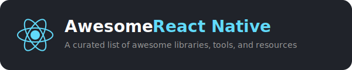

  
   
   

  

    
    
    
  

  
<strong>A curated list of awesome React Native libraries, tools, and resources.</strong>

  
Actively maintained. Contributions welcome.

## Contents

- [Component Libraries](#component-libraries)
- [UI Components](#ui-components)
  - [Buttons & Actions](#buttons--actions)
  - [Cards & Containers](#cards--containers)
  - [Forms & Inputs](#forms--inputs)
  - [Modals, Sheets & Overlays](#modals-sheets--overlays)
  - [Toasts & Notifications](#toasts--notifications)
  - [Progress, Loaders & Skeletons](#progress-loaders--skeletons)
  - [Charts & Data Visualization](#charts--data-visualization)
  - [Calendars & Date/Time Pickers](#calendars--datetime-pickers)
  - [Image & Media Display](#image--media-display)
  - [Icons](#icons)
  - [Typography & Rich Text](#typography--rich-text)
  - [Lists & Tables](#lists--tables)
  - [Haptics](#haptics)
  - [Keyboard](#keyboard)
  - [Graphics & Drawing](#graphics--drawing)
- [Navigation](#navigation)
- [State Management](#state-management)
- [Styling & Theming](#styling--theming)
- [Animation & Gestures](#animation--gestures)
- [Data Fetching & Networking](#data-fetching--networking)
- [Storage & Database](#storage--database)
- [Authentication & Security](#authentication--security)
- [Camera & Vision](#camera--vision)
- [Audio & Video](#audio--video)
- [Maps & Location](#maps--location)
- [Payments & In-App Purchases](#payments--in-app-purchases)
- [Push Notifications](#push-notifications)
- [Internationalization (i18n)](#internationalization-i18n)
- [Accessibility](#accessibility)
- [Deep Linking](#deep-linking)
- [Testing](#testing)
- [Developer Tools](#developer-tools)
- [Performance Monitoring & Analytics](#performance-monitoring--analytics)
- [CI/CD & Build Tools](#cicd--build-tools)
- [Backend & BaaS](#backend--baas)
- [OTA Updates](#ota-updates)
- [Templates & Boilerplates](#templates--boilerplates)
- [Open Source Apps](#open-source-apps)
- [Frameworks & Platforms](#frameworks--platforms)
- [AI Agent Skills](#ai-agent-skills)
- [Community](#community)

---

## Component Libraries

*Full design systems and UI kits with multiple components.*

- [Gluestack UI](https://github.com/gluestack/gluestack-ui) - Universal accessible components with Tailwind CSS support for React Native and Next.js.
- [HeroUI Native](https://github.com/heroui-inc/heroui-native) - Beautiful, fast and modern React Native UI library with pre-built components.
- [NativeBase](https://github.com/GeekyAnts/NativeBase) - Accessible component library inspired by Material UI, Chakra UI, and Ant Design.
- [React Native Elements](https://github.com/react-native-elements/react-native-elements) - Cross-platform UI toolkit with customizable components.
- [React Native Paper](https://github.com/callstack/react-native-paper) - Cross-platform Material Design library with M3 support by Callstack.
- [Tamagui](https://github.com/tamagui/tamagui) - Performance-focused UI kit with optimizing compiler that flattens component trees at build time.

## UI Components

### Buttons & Actions

- [React Native Bouncy Checkbox](https://github.com/WrathChaos/react-native-bouncy-checkbox) - Animated checkbox with customizable bounce effect.

### Cards & Containers

- [React Native Deck Swiper](https://github.com/weberapps/react-native-deck-swiper) - Tinder-like swipeable card deck component.

### Forms & Inputs

- [Formik](https://github.com/jaredpalmer/formik) - Complete form solution with intuitive API for validation and submission.
- [React Hook Form](https://github.com/react-hook-form/react-hook-form) - Performant form library with minimal re-renders and small bundle size.

### Modals, Sheets & Overlays

- [react-native-bottom-sheet](https://github.com/gorhom/react-native-bottom-sheet) - Performant bottom sheet with gesture interactions built on Reanimated.
- [react-native-modal](https://github.com/react-native-modal/react-native-modal) - Enhanced modal component with animations and backdrop customization.
- [react-native-true-sheet](https://github.com/lodev09/react-native-true-sheet) - Fully native bottom sheet with Fabric support and iOS Liquid Glass.

### Toasts & Notifications

*In-app toast and snackbar components.*

- [Burnt](https://github.com/nandorojo/burnt) - Native toast notifications using platform APIs, works on top of modals.
- [react-native-toast-message](https://github.com/calintamas/react-native-toast-message) - Animated toast message component with customizable presets.

### Progress, Loaders & Skeletons

- [react-native-auto-skeleton](https://github.com/pioner92/react-native-auto-skeleton) - Automatically generates skeleton loaders based on existing UI layout.

### Charts & Data Visualization

- [react-native-chart-kit](https://github.com/indiespirit/react-native-chart-kit) - Simple chart library with Bezier line charts and progress rings.
- [react-native-gifted-charts](https://github.com/Abhinandan-Kushwaha/react-native-gifted-charts) - Animated bar, line, and pie charts with 3D and gradient effects.
- [Victory Native](https://github.com/FormidableLabs/victory-native) - Modular charting library with extensive customization and interactive features.

### Calendars & Date/Time Pickers

- [Flash Calendar](https://github.com/MarceloPrado/flash-calendar) - Fast and flexible calendar library optimized for performance.
- [react-native-calendars](https://github.com/wix/react-native-calendars) - Customizable calendar components with marking and multi-period support.
- [react-native-ui-datepicker](https://github.com/farhoudshapouran/react-native-ui-datepicker) - Customizable date picker with Jalali calendar and NativeWind support.

### Image & Media Display

- [expo-image](https://docs.expo.dev/versions/latest/sdk/image/) - High-performance image component with caching, placeholders, and transitions.
- [expo-image-picker](https://docs.expo.dev/versions/latest/sdk/imagepicker/) - System UI for selecting images and videos with automatic permission handling.
- [react-native-image-picker](https://github.com/react-native-image-picker/react-native-image-picker) - Native UI for media selection with cropping and resizing options.

### Icons

- [Expo Vector Icons](https://github.com/expo/vector-icons) - Built on react-native-vector-icons with FontAwesome, MaterialIcons, and more.
- [Lucide React Native](https://github.com/lucide-icons/lucide) - 1,500+ clean, scalable icons with tree-shaking support.
- [react-native-vector-icons](https://github.com/oblador/react-native-vector-icons) - Customizable icon sets with full styling support.

### Typography & Rich Text

- [react-native-pell-rich-editor](https://github.com/wxik/react-native-rich-editor) - WebView-based WYSIWYG rich text editor.

### Lists & Tables

- [FlashList](https://github.com/Shopify/flash-list) - High-performance list by Shopify with better memory management than FlatList.
- [Legend List](https://github.com/LegendApp/legend-list) - High-performance list with dynamic item sizes and smooth scrolling from the Legend State team.
- [react-native-sortables](https://github.com/MatiPl01/react-native-sortables) - Drag-and-drop sortable grid and list components with gesture-based reordering.

### Haptics

- [@mhpdev/react-native-haptics](https://github.com/mhpdev-com/react-native-haptics) - High-performance haptics for iOS and Android built with Turbo Modules on the UI thread.
- [expo-haptics](https://docs.expo.dev/versions/latest/sdk/haptics/) - Haptic feedback API for iOS and Android with impact, notification, and selection styles.

### Keyboard

- [react-native-keyboard-controller](https://github.com/kirillzyusko/react-native-keyboard-controller) - Keyboard manager with frame-level control, interactive dismissal, and consistent cross-platform behavior.

### Graphics & Drawing

- [React Native Skia](https://github.com/Shopify/react-native-skia) - High-performance 2D graphics using the Skia engine by Shopify.

## Navigation

- [Expo Router](https://github.com/expo/router) - File-based routing built on React Navigation with universal links support.
- [React Navigation](https://github.com/react-navigation/react-navigation) - Extensible navigation library with stack, tab, and drawer navigators.

## State Management

- [Jotai](https://github.com/pmndrs/jotai) - Atomic state management with automatic garbage collection.
- [Legend State](https://github.com/LegendApp/legend-state) - Fast state library with fine-grained reactivity and persistence.
- [MobX](https://github.com/mobxjs/mobx) - Simple, scalable state management with reactive programming.
- [Redux Toolkit](https://github.com/reduxjs/redux-toolkit) - Official Redux toolset with simplified store setup and RTK Query.
- [TanStack Query](https://github.com/TanStack/query) - Powerful data fetching and caching library with DevTools.
- [Zustand](https://github.com/pmndrs/zustand) - Lightweight 1KB state library with minimal boilerplate.

## Styling & Theming

- [NativeWind](https://github.com/nativewind/nativewind) - Tailwind CSS for React Native with universal styling support.
- [Unistyles](https://github.com/jpudysz/react-native-unistyles) - Low-level styling library with breakpoints, themes, and runtime style updates.
- [Uniwind](https://uniwind.dev/) - Fast Tailwind CSS bindings for React Native with familiar web-based class syntax.

## Animation & Gestures

- [lottie-react-native](https://github.com/lottie-react-native/lottie-react-native) - Adobe After Effects animations rendered natively with vector graphics.
- [Moti](https://github.com/nandorojo/moti) - Declarative animation library built on Reanimated with Framer Motion-like API.
- [react-native-gesture-handler](https://github.com/software-mansion/react-native-gesture-handler) - Native-driven gesture management system replacing RN touch system.
- [react-native-reanimated](https://github.com/software-mansion/react-native-reanimated) - Native-level animations with worklet support for complex interactions.
- [react-native-screen-transitions](https://github.com/eds2002/react-native-screen-transitions) - Gesture-driven screen transitions with shared elements and ready-made presets.

## Data Fetching & Networking

- [axios](https://github.com/axios/axios) - Promise-based HTTP client with interceptors and request cancellation.
- [SWR](https://github.com/vercel/swr) - React hooks for data fetching with stale-while-revalidate strategy.
- [tRPC](https://github.com/trpc/trpc) - End-to-end typesafe APIs with TanStack Query integration.

## Storage & Database

- [expo-cloud-settings](https://github.com/TheNaubit/expo-cloud-settings) - iCloud key-value synchronization across iOS devices using React hooks.
- [MMKV](https://github.com/mrousavy/react-native-mmkv) - Fast key-value storage, 30x faster than AsyncStorage.
- [react-native-async-storage](https://github.com/react-native-async-storage/async-storage) - Asynchronous key-value storage system for React Native.
- [Realm](https://github.com/realm/realm-js) - Mobile database with native objects, live queries, and sync.
- [expo-sqlite](https://docs.expo.dev/versions/latest/sdk/sqlite/) - SQLite database access with synchronous and asynchronous APIs.
- [WatermelonDB](https://github.com/Nozbe/WatermelonDB) - Reactive SQLite database optimized for complex React Native apps.

## Authentication & Security

- [Better Auth](https://www.better-auth.com/) - Comprehensive TypeScript authentication framework with social sign-on, MFA, and multi-tenant support.
- [expo-auth-session](https://docs.expo.dev/versions/latest/sdk/auth-session/) - OAuth and OpenID Connect authentication flows.
- [expo-local-authentication](https://docs.expo.dev/versions/latest/sdk/local-authentication/) - Biometric authentication with Face ID and Touch ID.
- [expo-secure-store](https://docs.expo.dev/versions/latest/sdk/securestore/) - Encrypted key-value storage for sensitive data.
- [expo-stable-id](https://github.com/TheNaubit/expo-stable-id) - Persistent cross-device user identifier using iCloud sync and secure local storage.
- [react-native-keychain](https://github.com/oblador/react-native-keychain) - Secure credential storage using iOS Keychain and Android Keystore.

## Camera & Vision

- [expo-camera](https://docs.expo.dev/versions/latest/sdk/camera/) - Camera library with photo and video recording support.
- [react-native-vision-camera](https://github.com/mrousavy/react-native-vision-camera) - High-performance camera with frame processors and real-time AI capabilities.

## Audio & Video

- [expo-audio](https://docs.expo.dev/versions/latest/sdk/audio/) - Audio playback and recording with various source options.
- [expo-video](https://docs.expo.dev/versions/latest/sdk/video/) - Modern video player with DRM, subtitle tracks, and picture-in-picture.
- [react-native-video](https://github.com/react-native-video/react-native-video) - Video component with DRM, background playback, and streaming support.

## Maps & Location

- [expo-location](https://docs.expo.dev/versions/latest/sdk/location/) - Location services API for accessing device position and geofencing.
- [MapLibre React Native](https://github.com/maplibre/maplibre-react-native) - Interactive vector tile maps with MapLibre Native.
- [react-native-maps](https://github.com/react-native-maps/react-native-maps) - Map components using Google Maps and Apple Maps.

## Payments & In-App Purchases

- [react-native-iap](https://github.com/dooboolab/react-native-iap) - In-app purchase library for iOS and Android stores.
- [RevenueCat](https://github.com/RevenueCat/react-native-purchases) - In-app subscriptions and purchase management with analytics.
- [Stripe React Native](https://github.com/stripe/stripe-react-native) - Payment processing with Apple Pay and Google Pay support.
- [Superwall](https://superwall.com/) - No-code paywall platform with A/B testing, analytics, and Expo SDK support.

## Push Notifications

- [expo-notifications](https://docs.expo.dev/versions/latest/sdk/notifications/) - Notification API with unified push notification service.
- [Notifee](https://github.com/invertase/notifee) - Advanced notification library with custom layouts and actions.
- [OneSignal](https://github.com/OneSignal/react-native-onesignal) - Push notification service with segmentation and analytics.

## Internationalization (i18n)

- [expo-localization](https://docs.expo.dev/versions/latest/sdk/localization/) - Access to device locale and region settings.
- [i18next](https://github.com/i18next/i18next) - Internationalization framework with react-i18next React Native integration.
- [Lingui](https://github.com/lingui/js-lingui) - ICU MessageFormat-based i18n library with compile-time message extraction and React Native support.
- [react-native-localize](https://github.com/zoontek/react-native-localize) - Locale and timezone utilities for React Native.

## Accessibility

- [React Native Accessibility](https://reactnative.dev/docs/accessibility) - Built-in accessibility APIs for VoiceOver and TalkBack support.
- [react-native-ama](https://github.com/FormidableLabs/react-native-ama) - Accessibility testing and enforcement library by Formidable.

## Deep Linking

- [Branch](https://github.com/BranchMetrics/react-native-branch-deep-linking-attribution) - Attribution and deferred deep linking platform.
- [expo-linking](https://docs.expo.dev/versions/latest/sdk/linking/) - Deep link utilities with universal links support.

## Testing

- [Appium](https://github.com/appium/appium) - Cross-platform mobile automation framework.
- [Detox](https://github.com/wix/Detox) - Gray-box E2E testing with auto-synchronization by Wix.
- [Maestro](https://github.com/mobile-dev-inc/maestro) - Mobile UI testing with declarative YAML-based flows.
- [React Native Testing Library](https://github.com/callstack/react-native-testing-library) - User-centric component testing library by Callstack.

## Developer Tools

- [expo-dev-client](https://docs.expo.dev/develop/development-builds/introduction/) - Custom development builds with native module support.
- [Radon IDE](https://github.com/software-mansion/radon-ide) - VSCode extension turning your editor into a React Native IDE.
- [React Native DevTools](https://reactnative.dev/docs/debugging) - Official debugger for React Native 0.76+.
- [Reactotron](https://github.com/infinitered/reactotron) - Desktop app for inspecting React Native apps without debug mode.

## Performance Monitoring & Analytics

- [PostHog](https://github.com/PostHog/posthog-react-native) - Product analytics with feature flags, session replay, and A/B testing.
- [Sentry](https://github.com/getsentry/sentry-react-native) - Error tracking and performance monitoring with profiling support.

## CI/CD & Build Tools

- [EAS](https://expo.dev/eas) - Expo Application Services for cloud builds, submissions, and updates.
- [Fastlane](https://github.com/fastlane/fastlane) - Automation tool for iOS and Android build, test, and release pipelines.

## Backend & BaaS

- [Appwrite](https://github.com/appwrite/appwrite) - Self-hosted BaaS with auth, databases, storage, and functions.
- [AWS Amplify](https://github.com/aws-amplify/amplify-js) - AWS cloud services integration for mobile and web apps.
- [Convex](https://github.com/get-convex/convex-backend) - TypeScript-first backend with real-time data sync and serverless functions.
- [React Native Firebase](https://github.com/invertase/react-native-firebase) - Firebase SDK with Firestore, Auth, Cloud Functions, analytics, and more.
- [Supabase](https://github.com/supabase/supabase) - Open-source Firebase alternative built on PostgreSQL.

## OTA Updates

- [expo-updates](https://docs.expo.dev/versions/latest/sdk/updates/) - OTA update library for Expo and bare React Native apps.

## Templates & Boilerplates

- [Better-T Stack](https://better-t-stack.dev/) - Full-stack TypeScript starter with tRPC, Drizzle, and optional React Native support.
- [create-expo-app](https://docs.expo.dev/get-started/create-a-project/) - Official Expo project bootstrapping tool with multiple templates.
- [create-t3-turbo](https://github.com/t3-oss/create-t3-turbo) - Monorepo template with Expo, tRPC, Tailwind, and Next.js.
- [Ignite](https://github.com/infinitered/ignite) - Battle-tested boilerplate by Infinite Red with MobX-State-Tree and generators.

## Open Source Apps

*Production and showcase apps built with React Native.*

- [Bluesky](https://github.com/bluesky-social/social-app) - Decentralized social networking app built with Expo and React Native.
- [Expensify](https://github.com/Expensify/App) - Production expense tracking app showing enterprise React Native architecture.
- [Mattermost Mobile](https://github.com/mattermost/mattermost-mobile) - Open-source collaboration platform built with React Native.

## Frameworks & Platforms

- [Expo](https://github.com/expo/expo) - Framework and platform for universal React Native applications.
- [expo-apple-targets](https://github.com/EvanBacon/expo-apple-targets) - Expo Config Plugin for generating Apple Targets like Widgets and App Clips.
- [expo-watch-connectivity](https://github.com/ixacik/expo-watch-connectivity) - Apple Watch communication using WatchConnectivity with real-time messaging and background sync.
- [React Native](https://github.com/facebook/react-native) - Framework for building native apps using React by Meta.
- [react-native-macos](https://github.com/microsoft/react-native-macos) - React Native for macOS desktop applications.
- [react-native-windows](https://github.com/microsoft/react-native-windows) - React Native for Windows desktop applications.
- [Re.Pack](https://github.com/callstack/repack) - Webpack-based bundler for React Native with module federation support.

## AI Agent Skills

*Skills and context files for AI coding agents (Claude Code, OpenCode, Codex, Cursor, etc.) to build better React Native apps.*

### Agents

- [Claude Code](https://docs.anthropic.com/en/docs/build-with-claude/claude-code) - Anthropic's CLI coding agent with skills support for React Native workflows.
- [OpenAI Codex](https://github.com/openai/codex) - OpenAI's terminal coding agent with AGENTS.md-based configuration.
- [OpenCode](https://github.com/opencode-ai/opencode) - Open-source AI coding agent with TUI, multi-provider support, and MCP integration.

### Skills

- [building-native-ui](https://skills.sh/expo/skills/building-native-ui) - Complete guide for building beautiful apps with Expo Router, styling, navigation, and animations.
- [expo-api-routes](https://skills.sh/expo/skills/expo-api-routes) - Guidelines for creating API routes in Expo Router with EAS Hosting.
- [expo-cicd-workflows](https://skills.sh/expo/skills/expo-cicd-workflows) - Guidance on writing EAS workflow YAML files for CI/CD pipelines.
- [expo-deployment](https://skills.sh/expo/skills/expo-deployment) - Deploying Expo apps to iOS App Store, Android Play Store, web hosting, and API routes.
- [expo-dev-client](https://skills.sh/expo/skills/expo-dev-client) - Build and distribute Expo development clients locally or via TestFlight.
- [expo-tailwind-setup](https://skills.sh/expo/skills/expo-tailwind-setup) - Set up Tailwind CSS v4 in Expo with NativeWind v5 for universal styling.
- [heroui-native](https://v3.heroui.com/docs/native/getting-started/agent-skills) - AI skill for building mobile UIs with HeroUI Native components.
- [native-data-fetching](https://skills.sh/expo/skills/native-data-fetching) - Network requests, API calls, and data fetching patterns with caching and offline support.
- [upgrading-expo](https://skills.sh/expo/skills/upgrading-expo) - Guidelines for upgrading Expo SDK versions and fixing dependency issues.
- [use-dom](https://skills.sh/expo/skills/use-dom) - Expo DOM components to run web code in a webview on native and as-is on web.
- [vercel-react-native-skills](https://skills.sh/vercel-labs/agent-skills/vercel-react-native-skills) - React Native and Expo best practices covering performance, animations, and UI patterns by Vercel.

## Community

- [React Native Communities](https://reactnative.dev/community/communities) - Official list of communities and resources.
- [React Native subreddit](https://www.reddit.com/r/reactnative/) - Reddit community for React Native developers.

## Contributing

Contributions are welcome! Please read the [contributing guidelines](CONTRIBUTING.md) first. All entries must be actively maintained and well-documented.
